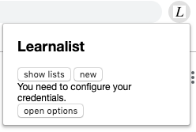
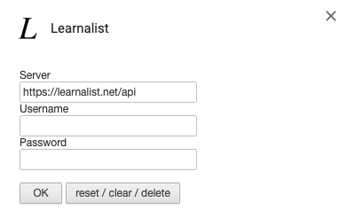

# Learnalist chrome extension

# Notes
* You will need a user, or else it wont work.
* It is a first version, no tests and put together just because I can.

# What does it do?
* Options, allows you to set the server and your username and password, we store the basicAuth on localStorage.
* Popup, allows you to view your lists, add a list, edit a list, delete a list.

# Install via source (git).

* Clone the git repo
```sh
git clone https://github.com/freshteapot/learnalist-chrome-extension.git
```

* Open chrome and goto:
```
chrome://extension
```
* Click Load unpacked
* Find the repo and select "learnalist"
* Enjoy!


# Credits
* First version came from modifying [chrome_vue_ext_demo](https://github.com/tobyqin/chrome_vue_ext_demo.git).


# References
* [Vue.js and CSP environments](https://vuejs.org/v2/guide/installation.html#CSP-environments).
* As mentioned in the credits,[chrome_vue_ext_demo](https://github.com/tobyqin/chrome_vue_ext_demo.git).
* Info about [icons](https://developer.chrome.com/apps/manifest/icons).

# Screenshots
## Welcome screen

## Options page

## Sample lists screen

